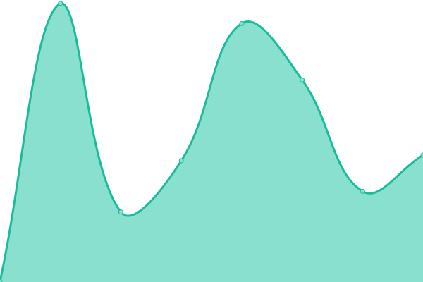

# [📈 Live Status](https://KeeFORCE.github.io/upptime): <!--live status--> **🟧 Partial outage**

This repository contains the open-source uptime monitor and status page for [KeeFORCE](https://keeforce.com/), powered by [Upptime](https://github.com/upptime/upptime).

With [Upptime](https://upptime.js.org), you can get your own unlimited and free uptime monitor and status page, powered entirely by a GitHub repository. We use [Issues](https://github.com/KeeFORCE/upptime/issues) as incident reports, [Actions](https://github.com/KeeFORCE/upptime/actions) as uptime monitors, and [Pages](https://KeeFORCE.github.io/upptime) for the status page.

<!--start: status pages-->
<!-- This summary is generated by Upptime (https://github.com/upptime/upptime) -->
<!-- Do not edit this manually, your changes will be overwritten -->
<!-- prettier-ignore -->
| URL | Status | History | Response Time | Uptime |
| --- | ------ | ------- | ------------- | ------ |
|  [Kaseya VSA](https://na1vsa107.kaseya.net/vsapres/web20/core/login.aspx) | 🟩 Up | [kaseya-vsa.yml](https://github.com/KeeFORCE/upptime/commits/HEAD/history/kaseya-vsa.yml) | 

 461ms
     
 | 

<a href="https://KeeFORCE.github.io/upptime/history/kaseya-vsa">100.00%</a>
    

|  [ConnectWise Manage](https://connect.keeforce.com/) | 🟥 Down | [connect-wise-manage.yml](https://github.com/KeeFORCE/upptime/commits/HEAD/history/connect-wise-manage.yml) | 

 0ms
     
 | 

<a href="https://KeeFORCE.github.io/upptime/history/connect-wise-manage">0.00%</a>
    

|  [3CX Phone](https://keephone01.keeforce.com/webclient/#/login) | 🟩 Up | [3-cx-phone.yml](https://github.com/KeeFORCE/upptime/commits/HEAD/history/3-cx-phone.yml) | 

 203ms
     
 | 

<a href="https://KeeFORCE.github.io/upptime/history/3-cx-phone">100.00%</a>
    

|  [KF JR Cloud](https://keeforce.keeforcecloud.com/jobrouter/#/login) | 🟩 Up | [kf-jr-cloud.yml](https://github.com/KeeFORCE/upptime/commits/HEAD/history/kf-jr-cloud.yml) | 

 1006ms
     
 | 

<a href="https://KeeFORCE.github.io/upptime/history/kf-jr-cloud">100.00%</a>
    

<!--end: status pages-->

[**Visit our status website →**](https://KeeFORCE.github.io/upptime)

## 📄 License

- Powered by: [Upptime](https://github.com/upptime/upptime)
- Code: [MIT](./LICENSE) © [KeeFORCE](https://keeforce.com/)
- Data in the `./history` directory: [Open Database License](https://opendatacommons.org/licenses/odbl/1-0/)
